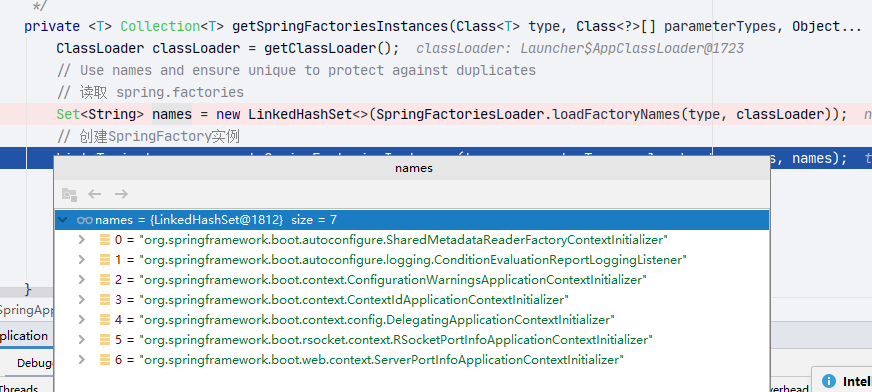
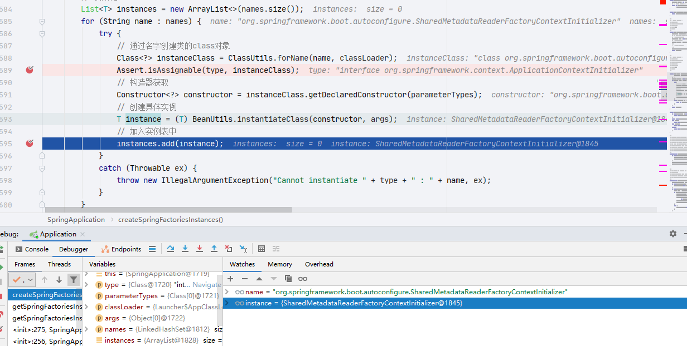
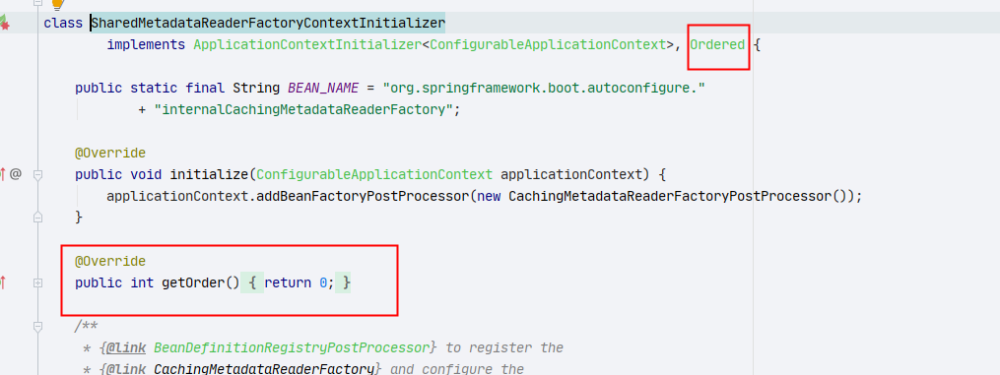
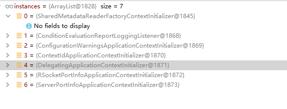
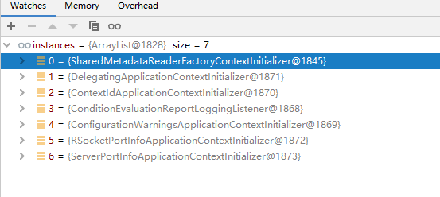

# SpringBoot 启动方法

- Author: [HuiFer](https://github.com/huifer)
- 源码阅读仓库: [SourceHot-spring-boot](https://github.com/SourceHot/spring-boot-read)

## 入口

- 通常一个简单的 SpringBoot 基础项目我们会有如下代码

```java
@SpringBootApplication
@RestController
@RequestMapping("/")
public class Application {

	public static void main(String[] args) {
		SpringApplication.run(Application.class, args);
	}

}

```

- 值得关注的有`SpringApplication.run`以及注解`@SpringBootApplication`

### run 方法

```java
	public ConfigurableApplicationContext run(String... args) {
	    // 秒表
		StopWatch stopWatch = new StopWatch();
		stopWatch.start();
		//ConfigurableApplicationContext 接口的作用就是设置上下文 ID，设置父应用上下文，添加监听器，刷新容器，关闭，判断是否活跃
		ConfigurableApplicationContext context = null;
		Collection<SpringBootExceptionReporter> exceptionReporters = new ArrayList<>();
		configureHeadlessProperty();
		// 获取监听器,run监听器->启动监听器
		SpringApplicationRunListeners listeners = getRunListeners(args);
		// 监听器启动
		listeners.starting();
		try {
		    // application 启动参数列表
			ApplicationArguments applicationArguments = new DefaultApplicationArguments(args);
			ConfigurableEnvironment environment = prepareEnvironment(listeners, applicationArguments);
			// 配置忽略的bean信息
			configureIgnoreBeanInfo(environment);
			Banner printedBanner = printBanner(environment);
			// 创建应用上下文
			context = createApplicationContext();
			exceptionReporters = getSpringFactoriesInstances(SpringBootExceptionReporter.class,
					new Class[] { ConfigurableApplicationContext.class }, context);
		    // 准备上下文，装配bean
			prepareContext(context, environment, listeners, applicationArguments, printedBanner);
			// 上下文刷新
			refreshContext(context);
			// 刷新后做什么
			afterRefresh(context, applicationArguments);
			stopWatch.stop();
			if (this.logStartupInfo) {
				new StartupInfoLogger(this.mainApplicationClass).logStarted(getApplicationLog(), stopWatch);
			}
			// 监听器开始了
			listeners.started(context);
			// 唤醒
			callRunners(context, applicationArguments);
		}
		catch (Throwable ex) {
			handleRunFailure(context, ex, exceptionReporters, listeners);
			throw new IllegalStateException(ex);
		}

		try {
		    // 监听器正式运行
			listeners.running(context);
		}
		catch (Throwable ex) {
			handleRunFailure(context, ex, exceptionReporters, null);
			throw new IllegalStateException(ex);
		}
		return context;
	}

```

### getRunListeners

- 获取监听器

```java
	private SpringApplicationRunListeners getRunListeners(String[] args) {
		Class<?>[] types = new Class<?>[] { SpringApplication.class, String[].class };
		// 获取  Spring Factory 实例对象
		return new SpringApplicationRunListeners(logger,
				getSpringFactoriesInstances(SpringApplicationRunListener.class, types, this, args));
	}


	private <T> Collection<T> getSpringFactoriesInstances(Class<T> type, Class<?>[] parameterTypes, Object... args) {
		ClassLoader classLoader = getClassLoader();
		// Use names and ensure unique to protect against duplicates
		// 读取 spring.factories
		Set<String> names = new LinkedHashSet<>(SpringFactoriesLoader.loadFactoryNames(type, classLoader));
		// 创建SpringFactory实例
		List<T> instances = createSpringFactoriesInstances(type, parameterTypes, classLoader, args, names);
		/**
		 * 排序 {@link Ordered}
		 */
		AnnotationAwareOrderComparator.sort(instances);
		return instances;
	}
```

### createSpringFactoriesInstances

```java
@SuppressWarnings("unchecked")
private <T> List<T> createSpringFactoriesInstances(Class<T> type, Class<?>[] parameterTypes,
		ClassLoader classLoader, Object[] args, Set<String> names) {
    // 初始化
	List<T> instances = new ArrayList<>(names.size());
	for (String name : names) {
		try {
		    // 通过名字创建类的class对象
			Class<?> instanceClass = ClassUtils.forName(name, classLoader);
			Assert.isAssignable(type, instanceClass);
			// 构造器获取
			Constructor<?> constructor = instanceClass.getDeclaredConstructor(parameterTypes);
			// 创建具体实例
			T instance = (T) BeanUtils.instantiateClass(constructor, args);
			// 加入实例表中
			instances.add(instance);
		}
		catch (Throwable ex) {
			throw new IllegalArgumentException("Cannot instantiate " + type + " : " + name, ex);
		}
	}
	return instances;
}

```

- `SpringFactoriesLoader.loadFactoryNames(type, classLoader)` 是 spring 提供的方法，主要目的是读取`spring.factories`文件
  - 读取需要创建的内容



- 创建完成

  

- `AnnotationAwareOrderComparator.sort(instances)`排序

  - 通过 spring 的源码我们知道这个方法是根据`order`的数字大小进行排序，观察

    `SharedMetadataReaderFactoryContextInitializer`

    

  - 同样的再找一个`DelegatingApplicationContextInitializer`

    

- 下图中的所有类都有 Order 数值返回

  排序前:



排序后：



### listeners.starting()

- `SpringApplicationRunListeners` : `org.springframework.boot.SpringApplicationRunListeners` 这个类是`org.springframework.boot.SpringApplicationRunListener`的集合表现形式

  ```
  class SpringApplicationRunListeners {

  	private final List<SpringApplicationRunListener> listeners;
  SpringApplicationRunListeners(Log log, Collection<? extends SpringApplicationRunListener> listeners) {
  		this.log = log;
  		this.listeners = new ArrayList<>(listeners);
  	}

  	void starting() {
  		for (SpringApplicationRunListener listener : this.listeners) {
  			listener.starting();
  		}
  	}

  }
  ```

  - 这里主要是启动`org.springframework.boot.SpringApplicationRunListener#starting`方法，只有一个实现`org.springframework.boot.context.event.EventPublishingRunListener#starting`

### prepareEnvironment

```java
	private ConfigurableEnvironment prepareEnvironment(SpringApplicationRunListeners listeners,
			ApplicationArguments applicationArguments) {
		// Create and configure the environment
		// 得到一个环境
		ConfigurableEnvironment environment = getOrCreateEnvironment();
		// 配置环境
		configureEnvironment(environment, applicationArguments.getSourceArgs());
		ConfigurationPropertySources.attach(environment);
		listeners.environmentPrepared(environment);
		// 绑定springBoot应用
		bindToSpringApplication(environment);
		// 是否创建自定义环境
		if (!this.isCustomEnvironment) {
			environment = new EnvironmentConverter(getClassLoader()).convertEnvironmentIfNecessary(environment,
					deduceEnvironmentClass());
		}
		ConfigurationPropertySources.attach(environment);
		return environment;
	}

```

### configureIgnoreBeanInfo

- 获取`spring.beaninfo.ignore`并且设置到环境信息中

```java
	private void configureIgnoreBeanInfo(ConfigurableEnvironment environment) {
		if (System.getProperty(CachedIntrospectionResults.IGNORE_BEANINFO_PROPERTY_NAME) == null) {
			Boolean ignore = environment.getProperty("spring.beaninfo.ignore", Boolean.class, Boolean.TRUE);
			System.setProperty(CachedIntrospectionResults.IGNORE_BEANINFO_PROPERTY_NAME, ignore.toString());
		}
	}
```

### printBanner

```java
	private Banner printBanner(ConfigurableEnvironment environment) {
		if (this.bannerMode == Banner.Mode.OFF) {
			return null;
		}
		ResourceLoader resourceLoader = (this.resourceLoader != null) ? this.resourceLoader
				: new DefaultResourceLoader(getClassLoader());
		// 创建打印器
		SpringApplicationBannerPrinter bannerPrinter = new SpringApplicationBannerPrinter(resourceLoader, this.banner);
		if (this.bannerMode == Mode.LOG) {
		    // 输出
			return bannerPrinter.print(environment, this.mainApplicationClass, logger);
		}
        // 输出
		return bannerPrinter.print(environment, this.mainApplicationClass, System.out);
	}

```

```
	Banner print(Environment environment, Class<?> sourceClass, PrintStream out) {
		Banner banner = getBanner(environment);
		banner.printBanner(environment, sourceClass, out);
		return new PrintedBanner(banner, sourceClass);
	}

```

- 最终输出内容类：`org.springframework.boot.SpringBootBanner`

  ```JAVA
  class SpringBootBanner implements Banner {

  	private static final String[] BANNER = { "", "  .   ____          _            __ _ _",
  			" /\\\\ / ___'_ __ _ _(_)_ __  __ _ \\ \\ \\ \\", "( ( )\\___ | '_ | '_| | '_ \\/ _` | \\ \\ \\ \\",
  			" \\\\/  ___)| |_)| | | | | || (_| |  ) ) ) )", "  '  |____| .__|_| |_|_| |_\\__, | / / / /",
  			" =========|_|==============|___/=/_/_/_/" };

  	private static final String SPRING_BOOT = " :: Spring Boot :: ";

  	private static final int STRAP_LINE_SIZE = 42;

  	@Override
  	public void printBanner(Environment environment, Class<?> sourceClass, PrintStream printStream) {
  		for (String line : BANNER) {
  			printStream.println(line);
  		}
  		String version = SpringBootVersion.getVersion();
  		version = (version != null) ? " (v" + version + ")" : "";
  		StringBuilder padding = new StringBuilder();
  		while (padding.length() < STRAP_LINE_SIZE - (version.length() + SPRING_BOOT.length())) {
  			padding.append(" ");
  		}

  		printStream.println(AnsiOutput.toString(AnsiColor.GREEN, SPRING_BOOT, AnsiColor.DEFAULT, padding.toString(),
  				AnsiStyle.FAINT, version));
  		printStream.println();
  	}

  }
  ```

### createApplicationContext

```JAVA
	protected ConfigurableApplicationContext createApplicationContext() {
	    // 获取上下文类
		Class<?> contextClass = this.applicationContextClass;
		if (contextClass == null) {
			try {
				// 根据不同类型选择创建的实例
				switch (this.webApplicationType) {
				case SERVLET:
					contextClass = Class.forName(DEFAULT_SERVLET_WEB_CONTEXT_CLASS);
					break;
				case REACTIVE:
					contextClass = Class.forName(DEFAULT_REACTIVE_WEB_CONTEXT_CLASS);
					break;
				default:
					contextClass = Class.forName(DEFAULT_CONTEXT_CLASS);
				}
			}
			catch (ClassNotFoundException ex) {
				throw new IllegalStateException(
						"Unable create a default ApplicationContext, please specify an ApplicationContextClass", ex);
			}
		}
		return (ConfigurableApplicationContext) BeanUtils.instantiateClass(contextClass);
	}

```

- `this.applicationContextClass` 初始化方法

```JAVA
	public SpringApplication(ResourceLoader resourceLoader, Class<?>... primarySources) {
		this.resourceLoader = resourceLoader;
		Assert.notNull(primarySources, "PrimarySources must not be null");
		this.primarySources = new LinkedHashSet<>(Arrays.asList(primarySources));
		// 设置 web应用类型
		this.webApplicationType = WebApplicationType.deduceFromClasspath();
		setInitializers((Collection) getSpringFactoriesInstances(ApplicationContextInitializer.class));
		setListeners((Collection) getSpringFactoriesInstances(ApplicationListener.class));
		this.mainApplicationClass = deduceMainApplicationClass();
	}
```

- `org.springframework.boot.WebApplicationType#deduceFromClasspath`

```JAVA
	static WebApplicationType deduceFromClasspath() {
		if (ClassUtils.isPresent(WEBFLUX_INDICATOR_CLASS, null) && !ClassUtils.isPresent(WEBMVC_INDICATOR_CLASS, null)
				&& !ClassUtils.isPresent(JERSEY_INDICATOR_CLASS, null)) {
			return WebApplicationType.REACTIVE;
		}
		for (String className : SERVLET_INDICATOR_CLASSES) {
			if (!ClassUtils.isPresent(className, null)) {
				return WebApplicationType.NONE;
			}
		}
		return WebApplicationType.SERVLET;
	}

```

### exceptionReporters


### prepareContext

```JAVA
	private void prepareContext(ConfigurableApplicationContext context, ConfigurableEnvironment environment,
			SpringApplicationRunListeners listeners, ApplicationArguments applicationArguments, Banner printedBanner) {
	    // 上下文中设置环境
		context.setEnvironment(environment);
		// 上下文处理
		postProcessApplicationContext(context);
		// 初始化
		applyInitializers(context);
		// 监听器中放入上下文
		listeners.contextPrepared(context);
		if (this.logStartupInfo) {
			logStartupInfo(context.getParent() == null);
			logStartupProfileInfo(context);
		}
		// Add boot specific singleton beans
		ConfigurableListableBeanFactory beanFactory = context.getBeanFactory();
		// 单例对象注册
		beanFactory.registerSingleton("springApplicationArguments", applicationArguments);
		if (printedBanner != null) {
			beanFactory.registerSingleton("springBootBanner", printedBanner);
		}
		if (beanFactory instanceof DefaultListableBeanFactory) {
			((DefaultListableBeanFactory) beanFactory)
					.setAllowBeanDefinitionOverriding(this.allowBeanDefinitionOverriding);
		}
		if (this.lazyInitialization) {
			context.addBeanFactoryPostProcessor(new LazyInitializationBeanFactoryPostProcessor());
		}
		// Load the sources
		Set<Object> sources = getAllSources();
		Assert.notEmpty(sources, "Sources must not be empty");
		// 加载上下文
		load(context, sources.toArray(new Object[0]));
		// 监听器做加载上下文操作
		listeners.contextLoaded(context);
	}

```

- `set`方法就不说了

### postProcessApplicationContext

```java
	protected void postProcessApplicationContext(ConfigurableApplicationContext context) {
		if (this.beanNameGenerator != null) {
		    // 注册 beanName 的生成器
			context.getBeanFactory().registerSingleton(AnnotationConfigUtils.CONFIGURATION_BEAN_NAME_GENERATOR,
					this.beanNameGenerator);
		}
		if (this.resourceLoader != null) {
			if (context instanceof GenericApplicationContext) {
			    // 设置资源加载器
				((GenericApplicationContext) context).setResourceLoader(this.resourceLoader);
			}
			if (context instanceof DefaultResourceLoader) {
			    // 设置类加载器
				((DefaultResourceLoader) context).setClassLoader(this.resourceLoader.getClassLoader());
			}
		}
		if (this.addConversionService) {
		    // 转换服务
			context.getBeanFactory().setConversionService(ApplicationConversionService.getSharedInstance());
		}
	}

```

- 看一下最终设置完成后的 context

  ```java
  context.getBeanFactory().setConversionService(ApplicationConversionService.getSharedInstance());
  ```


### applyInitializers

- 初始化应用上下文

```java
	@SuppressWarnings({ "rawtypes", "unchecked" })
	protected void applyInitializers(ConfigurableApplicationContext context) {
		for (ApplicationContextInitializer initializer : getInitializers()) {
			Class<?> requiredType = GenericTypeResolver.resolveTypeArgument(initializer.getClass(),
					ApplicationContextInitializer.class);
			Assert.isInstanceOf(requiredType, context, "Unable to call initializer.");
			initializer.initialize(context);
		}
	}

```

- 初始化 `List<ApplicationListener<?>> listeners`: `setInitializers((Collection) getSpringFactoriesInstances(ApplicationContextInitializer.class));`

- 获取 `List<ApplicationListener<?>> listeners`: `public Set<ApplicationListener<?>> getListeners() { return asUnmodifiableOrderedSet(this.listeners);}`

- 数据结果


- 子类的具体实现不展开了

### getAllSources

```java
	public Set<Object> getAllSources() {
		Set<Object> allSources = new LinkedHashSet<>();
		if (!CollectionUtils.isEmpty(this.primarySources)) {
			allSources.addAll(this.primarySources);
		}
		if (!CollectionUtils.isEmpty(this.sources)) {
			allSources.addAll(this.sources);
		}
		return Collections.unmodifiableSet(allSources);
	}

```

- `primarySources` 就是我们的项目启动类，在`SpringApplication`的构造器中有`this.primarySources = new LinkedHashSet<>(Arrays.asList(primarySources))`


### load

- 加载 bean 到应用上下文

```java
	protected void load(ApplicationContext context, Object[] sources) {
		if (logger.isDebugEnabled()) {
			logger.debug("Loading source " + StringUtils.arrayToCommaDelimitedString(sources));
		}
		// bean定义加载器
		BeanDefinitionLoader loader = createBeanDefinitionLoader(getBeanDefinitionRegistry(context), sources);
		if (this.beanNameGenerator != null) {
		    // 设置 beanName生成器
			loader.setBeanNameGenerator(this.beanNameGenerator);
		}
		if (this.resourceLoader != null) {
		    // 设置 资源加载器
			loader.setResourceLoader(this.resourceLoader);
		}
		if (this.environment != null) {
		    // 设置环境
			loader.setEnvironment(this.environment);
		}
		// 加载
		loader.load();
	}

```

```java
	int load() {
		int count = 0;
		for (Object source : this.sources) {
			count += load(source);
		}
		return count;
	}

```

```java
private int load(Object source) {
		Assert.notNull(source, "Source must not be null");
		if (source instanceof Class<?>) {
			return load((Class<?>) source);
		}
		if (source instanceof Resource) {
			return load((Resource) source);
		}
		if (source instanceof Package) {
			return load((Package) source);
		}
		if (source instanceof CharSequence) {
			return load((CharSequence) source);
		}
		throw new IllegalArgumentException("Invalid source type " + source.getClass());
	}

```

- 通过前文我们已经知道 `source`就是一个 class

  

```java
	private int load(Class<?> source) {
		if (isGroovyPresent() && GroovyBeanDefinitionSource.class.isAssignableFrom(source)) {
			// Any GroovyLoaders added in beans{} DSL can contribute beans here
			GroovyBeanDefinitionSource loader = BeanUtils.instantiateClass(source, GroovyBeanDefinitionSource.class);
			load(loader);
		}
		// 是否为组件
		if (isComponent(source)) {
			this.annotatedReader.register(source);
			return 1;
		}
		return 0;
	}

```

- 我们的启动类是一个组件，直接注册完成返回 1

### listeners.contextLoaded(context)

- 监听器行为: 在上下文资源加载后做一些事情

### refreshContext

- 上下文刷新

```java
	private void refreshContext(ConfigurableApplicationContext context) {
		refresh(context);
		if (this.registerShutdownHook) {
			try {
				context.registerShutdownHook();
			}
			catch (AccessControlException ex) {
				// Not allowed in some environments.
			}
		}
	}

```

```java
	/**
	 * Refresh the underlying {@link ApplicationContext}.
	 * @param applicationContext the application context to refresh
	 */
	protected void refresh(ApplicationContext applicationContext) {
		Assert.isInstanceOf(AbstractApplicationContext.class, applicationContext);
		((AbstractApplicationContext) applicationContext).refresh();
	}
```

- 最终来到了`org.springframework.context.support.AbstractApplicationContext#refresh`方法，此方法是 spring 的一个方法，此处不在阐述

### afterRefresh

- 刷新上下文之后做的事情,空的没有实现

  ```
  	protected void afterRefresh(ConfigurableApplicationContext context, ApplicationArguments args) {
  	}

  ```

### stopWatch.stop()

- 秒表结束

### listeners.started(context)

- 各类监听器启动

### callRunners

- 两种 runner 启动`ApplicationRunner` 和 `CommandLineRunner`

```JAVA
	private void callRunners(ApplicationContext context, ApplicationArguments args) {
		List<Object> runners = new ArrayList<>();
		runners.addAll(context.getBeansOfType(ApplicationRunner.class).values());
		runners.addAll(context.getBeansOfType(CommandLineRunner.class).values());
		AnnotationAwareOrderComparator.sort(runners);
		for (Object runner : new LinkedHashSet<>(runners)) {
			if (runner instanceof ApplicationRunner) {
				callRunner((ApplicationRunner) runner, args);
			}
			if (runner instanceof CommandLineRunner) {
				callRunner((CommandLineRunner) runner, args);
			}
		}
	}

```

```JAVA
private void callRunner(ApplicationRunner runner, ApplicationArguments args) {
		try {
			(runner).run(args);
		}
		catch (Exception ex) {
			throw new IllegalStateException("Failed to execute ApplicationRunner", ex);
		}
	}
```

### listeners.running(context)

- 监听器正式开始工作
